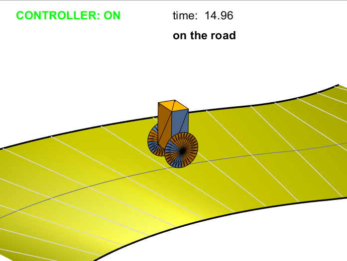

# LQR-Lane-Following

## Project from UIUC AE353

Using LQR controller to allow robot follow the center of the lane while keeping the inverse pendulum body balanced. The lane is generated randomly each time.

##### Screenshot

### The final report of this project: 
https://1drv.ms/b/s!Ahbetuf7cZNmnAoZ-eqSEzBAafm8

### The demo video of this project: 
https://www.youtube.com/watch?v=EdDsvUUiEvE

### Reference
MakeRoad.m file is provided by Professor Timothy Bretl from Aerospace Department at University of Illinois at Urbana-Champaign
